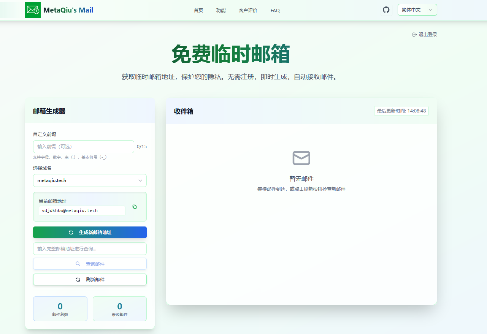

<div align="center">

# 📧 免费临时邮箱

<p align="center">
  
  
  
  
</p>

<p align="center">
  <strong>🚀 基于 Nuxt 3 的现代化临时邮箱服务</strong>
</p>

<p align="center">
  无需注册 • 即时生成 • 自动接收 • 隐私保护
</p>

</div>

---

## 🙏 重要说明

> **📢 本项目为自用版本，基于 [FreeTempMail](https://github.com/PennyJoly/FreeTempMail) 开源项目二次开发，感谢 [@PennyJoly](https://github.com/PennyJoly) 的原创贡献。  **

> 在原作的基础上新增了多域名配置，并添加了密码保护功能。

## 📸 项目预览

<div align="center">
  
</div>

## 🚀 快速开始

### 📋 环境要求

- **Node.js** >= 18.0.0
- **npm** / **pnpm** / **yarn**
- **IMAP 邮箱账号** (用于接收转发邮件)

### 🛠️ 安装步骤

```bash
# 1. 克隆项目
git clone https://github.com/your-username/your-repo-name.git
cd your-repo-name

# 2. 安装依赖
npm install
# 或者使用 pnpm (推荐)
pnpm install

# 3. 配置环境变量
cp .env.example .env.dev

# 4. 启动开发服务器
npm run dev
```

🎉 打开浏览器访问 `http://localhost:3000` 即可使用！

## ⚙️ 环境配置

### 📝 基础配置

在 `.env.dev` 文件中配置以下参数：

```bash
# 应用配置
NUXT_PUBLIC_APP_NAME=Your App Name
NUXT_PUBLIC_BASE_URL=http://localhost:3000
NUXT_PUBLIC_DOMAIN_URL=your-domain.com

# 多域名支持 (用逗号分隔)
NUXT_PUBLIC_AVAILABLE_DOMAINS=domain1.com,domain2.com,domain3.com

# 密码保护 (可选)
ACCESS_PASSWORD=your-secure-password

# 服务端口
PORT=3000
```

### 📧 IMAP 邮箱配置

<details>
<summary><strong>📖 点击展开 IMAP 配置说明</strong></summary>

#### Gmail 配置示例
```bash
IMAP_HOST=imap.gmail.com
IMAP_PORT=993
IMAP_USERNAME=your-email@gmail.com
IMAP_PASSWORD=your-app-password  # 需要应用专用密码
IMAP_TLS=true
```

#### QQ 邮箱配置示例
```bash
IMAP_HOST=imap.qq.com
IMAP_PORT=993
IMAP_USERNAME=your-email@qq.com
IMAP_PASSWORD=your-authorization-code  # 需要授权码
IMAP_TLS=true
```

#### Outlook 配置示例
```bash
IMAP_HOST=outlook.office365.com
IMAP_PORT=993
IMAP_USERNAME=your-email@outlook.com
IMAP_PASSWORD=your-password
IMAP_TLS=true
```

</details>

## 🚀 一键部署

<div align="center">

### 快速部署到 Vercel

<a href="https://vercel.com/new/clone?repository-url=https://github.com/MetaQiu/FreeTempMail" target="_blank">
  
</a>

**或者选择其他平台：**

<table align="center" style="border-collapse: collapse; margin-top: 20px;">
  <tr>
    <td align="center" style="padding: 8px;">
      <a href="https://app.netlify.com/start/deploy?repository=https://github.com/MetaQiu/FreeTempMail" target="_blank">
        
      </a>
      <br>
      <small style="color: #666;">免费静态托管</small>
    </td>
    <td align="center" style="padding: 8px;">
      <a href="https://railway.app/template/FreeTempMail?referralCode=bonus" target="_blank">
        
      </a>
      <br>
      <small style="color: #666;">现代化部署平台</small>
    </td>
    <td align="center" style="padding: 8px;">
      <a href="https://render.com/deploy?repo=https://github.com/MetaQiu/FreeTempMail" target="_blank">
        
      </a>
      <br>
      <small style="color: #666;">全栈应用托管</small>
    </td>
  </tr>
</table>

<p style="margin-top: 20px; color: #666; font-size: 14px;">
  💡 <strong>提示：</strong>部署前请确保已配置好环境变量，详见 <a href="#%EF%B8%8F-环境配置">环境配置</a> 部分
</p>

### 📋 部署步骤

<details>
<summary><strong>🔧 Vercel 部署配置</strong></summary>

1. **点击上方 Deploy 按钮**
2. **导入仓库到 Vercel**
3. **配置环境变量：**
   ```bash
   # 必需的环境变量
   NUXT_PUBLIC_APP_NAME=Your App Name
   NUXT_PUBLIC_BASE_URL=https://your-domain.vercel.app
   NUXT_PUBLIC_DOMAIN_URL=your-custom-domain.com
   NUXT_PUBLIC_AVAILABLE_DOMAINS=domain1.com,domain2.com

   # IMAP 配置
   IMAP_HOST=imap.gmail.com
   IMAP_PORT=993
   IMAP_USERNAME=your-email@gmail.com
   IMAP_PASSWORD=your-app-password
   IMAP_TLS=true

   # 可选：密码保护
   ACCESS_PASSWORD=your-secure-password
   ```
4. **点击 Deploy 开始部署**
5. **等待部署完成，获取访问链接**

</details>

<details>
<summary><strong>🌐 自定义域名配置详细指南</strong></summary>

#### 步骤 1: 在 Vercel 项目设置中添加自定义域名

1. **登录 Vercel 控制台**
   - 访问 [vercel.com](https://vercel.com) 并登录
   - 找到您的 FreeTempMail 项目

2. **进入项目设置**
   ```
   项目页面 → Settings → Domains
   ```

3. **添加自定义域名**
   - 在 "Add Domain" 输入框中输入您的域名
   - 例如：`mail.yourdomain.com` 或 `yourdomain.com`
   - 点击 "Add" 按钮

4. **选择域名类型**
   - **根域名**：`yourdomain.com`
   - **子域名**：`mail.yourdomain.com`（推荐用于邮箱服务）

#### 步骤 2: 配置 DNS 记录指向 Vercel

根据您的域名类型，需要在域名注册商或DNS服务商处添加相应记录：

**方案 A: 子域名配置（推荐）**
```dns
类型: CNAME
名称: mail（或您选择的子域名）
值: cname.vercel-dns.com
TTL: 3600（或自动）
```

**方案 B: 根域名配置**
```dns
类型: A
名称: @（或留空）
值: 76.76.19.61
TTL: 3600

类型: CNAME
名称: www
值: cname.vercel-dns.com
TTL: 3600
```

**常见DNS服务商配置示例：**

<details>
<summary>📍 Cloudflare 配置</summary>

1. 登录 Cloudflare 控制台
2. 选择您的域名
3. 进入 "DNS" → "Records"
4. 点击 "Add record"
5. 填入上述DNS记录信息
6. 确保 "Proxy status" 为灰色云朵（DNS only）

</details>

<details>
<summary>📍 阿里云域名配置</summary>

1. 登录阿里云控制台
2. 进入 "域名" → "域名列表"
3. 点击域名后的 "解析"
4. 点击 "添加记录"
5. 填入DNS记录信息

</details>

<details>
<summary>📍 腾讯云域名配置</summary>

1. 登录腾讯云控制台
2. 进入 "域名注册" → "我的域名"
3. 点击 "解析"
4. 添加相应的DNS记录

</details>

#### 步骤 3: 更新环境变量

在 Vercel 项目中更新环境变量：

1. **进入环境变量设置**
   ```
   Vercel项目 → Settings → Environment Variables
   ```

2. **更新相关变量**
   ```bash
   # 更新基础URL为您的自定义域名
   NUXT_PUBLIC_BASE_URL=https://mail.yourdomain.com

   # 更新域名URL（用于邮箱域名）
   NUXT_PUBLIC_DOMAIN_URL=yourdomain.com

   # 如果有多个域名，用逗号分隔
   NUXT_PUBLIC_AVAILABLE_DOMAINS=yourdomain.com,anotherdomain.com
   ```

3. **保存环境变量**

#### 步骤 4: 重新部署项目

1. **触发重新部署**
   - 方法1：在 Vercel 控制台点击 "Redeploy"
   - 方法2：向 GitHub 仓库推送新的提交
   - 方法3：在 Deployments 页面点击最新部署的 "..." → "Redeploy"

2. **验证部署**
   - 等待部署完成（通常1-3分钟）
   - 访问您的自定义域名验证是否正常工作
   - 检查SSL证书是否自动配置（Vercel会自动处理）

#### 🔍 故障排除

**常见问题及解决方案：**

1. **域名无法访问**
   - 检查DNS记录是否正确配置
   - 等待DNS传播（可能需要24-48小时）
   - 使用 [DNS检查工具](https://www.whatsmydns.net/) 验证

2. **SSL证书问题**
   - Vercel会自动配置Let's Encrypt证书
   - 如果证书未生效，等待几分钟后重试

3. **环境变量未生效**
   - 确保重新部署了项目
   - 检查环境变量名称是否正确

4. **邮箱功能异常**
   - 确认 `NUXT_PUBLIC_DOMAIN_URL` 设置正确
   - 检查IMAP配置是否完整

</details>

</div>


## 📄 开源协议

本项目基于 [MIT License](LICENSE) 开源协议。

## 🔗 相关链接

- 🌟 [原项目 FreeTempMail](https://github.com/PennyJoly/FreeTempMail)
- 👨‍💻 [原作者 @PennyJoly](https://github.com/PennyJoly)
- 🚀 [NuxtPro 商业版](https://nuxtpro.com)

---

<div align="center">

### 💝 如果这个项目对您有帮助，请给个 ⭐ Star 支持一下！

**Made with ❤️ by developers, for developers**

</div>

